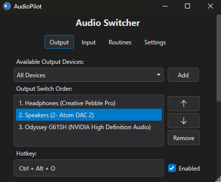
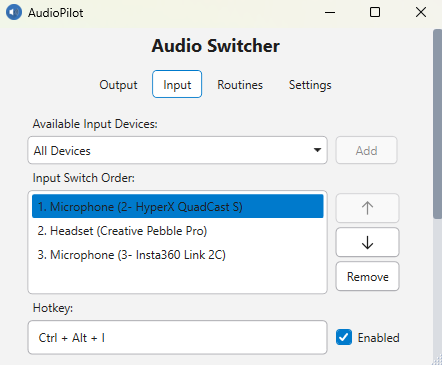
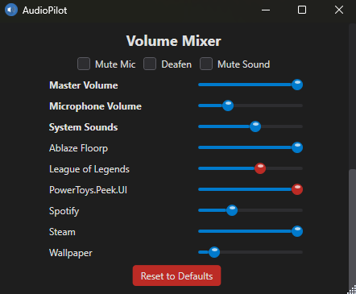
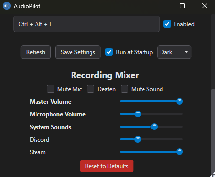
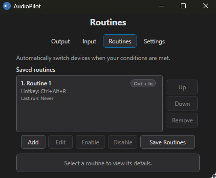

# AudioPilot

[](.github/workflows/ci.yml)
[](https://dotnet.microsoft.com/)
[](LICENSE)

AudioPilot is a free, open-source Windows app for audio controls and automation, built for gaming, calls, and everyday use.

- **Adjust the app you're using.** Lower a game's or browser's volume with a hotkey while leaving other apps alone.
- **Control your microphone while holding a key.** Use push-to-talk to speak, or hold-to-mute for a temporary pause.
- **Apply audio settings automatically.** Use routines to choose devices, volume levels, and mute states when an app
  opens, a device becomes available, or a schedule or other trigger fires.

Device-switching hotkeys, playback and recording mixers, media controls, and audio-status overlays are included too.
Configure the controls you need, then keep AudioPilot in the tray.

**[Download AudioPilot](https://github.com/Haanuwaa/AudioPilot/releases/latest)** |
[Choose a package](#get-audiopilot) | [Set up your first controls](#start-here)

<!-- markdownlint-disable MD033 -->
<p align="center">
  
  
</p>
<!-- markdownlint-enable MD033 -->

## Get AudioPilot

For most Windows PCs, choose the **x64 MSI installer** from the
[latest release](https://github.com/Haanuwaa/AudioPilot/releases/latest). It includes the runtime and installs for your
Windows account. Choose ARM64 for Windows on ARM, or a ZIP if you prefer a portable copy.

- Minimum compatible OS: Windows 10 version 2004 (build 19041) or later
- Official support: Windows 11 and currently supported Windows 10 Enterprise/LTSC editions that meet the minimum build,
  subject to the Microsoft and .NET 10 support lifecycles

**Unsigned downloads:** AudioPilot currently has no code-signing certificate. Windows may show an unknown-publisher
or SmartScreen warning. After checking the download source, right-click the ZIP or MSI, choose **Properties**, and
select **Unblock** if shown. Unblock a ZIP before extracting it. See the
[Windows download guidance](docs/USER_GUIDE.md#unsigned-downloads-and-windows-warnings) for details and SmartScreen prompts.

### Which Release Should I Download?

| If your machine is... | Recommended artifact | Why |
| --- | --- | --- |
| Most modern Windows PCs | `AudioPilot-<version>-x64.msi` | Includes the runtime, shortcuts, and Windows uninstall support |
| Windows on ARM | `AudioPilot-<version>-arm64.msi` | Native ARM64 installer with the runtime included |
| A PC where you want a portable copy | `SelfContained-win-x64.zip` or `SelfContained-win-arm64.zip` | Includes the runtime; extract the whole folder and run AudioPilot |
| Windows installations that require 32-bit binaries | `SelfContained-win-x86.zip` | Portable x86 build; no x86 MSI is provided |

### Self-Contained vs Framework-Dependent

| Package type | Choose it when... | Tradeoff |
| --- | --- | --- |
| Self-contained | You want the simplest download-and-run path | Larger download, but no separate .NET install |
| Framework-dependent | You already have the .NET Desktop Runtime 10 installed or want a smaller package | Smaller download, but requires the runtime on the machine |

## Start Here

Install the MSI or extract the whole ZIP, then launch AudioPilot. Start with whichever task you need:

| To start with... | Set up... |
| --- | --- |
| Volume controls for your game or browser | **Settings > Foreground App**: [assign volume or mute hotkeys](docs/USER_GUIDE.md#adjust-the-app-youre-using), then click **Apply Settings** |
| Push-to-talk or hold-to-mute | **Settings > Mute Controls > While holding a key**: [assign a hotkey](docs/USER_GUIDE.md#set-up-push-to-talk-or-hold-to-mute); push-to-talk also needs **Enable push-to-talk**. Click **Apply Settings** |
| Automatic audio settings | **Routines**: choose audio actions and a trigger, then save the routine and the routine list |
| Switching speakers, headsets, or microphones | **Output** or **Input**: add devices to the switch-order list, arrange them, assign a hotkey, and save |

Foreground and microphone-hold hotkeys are unassigned by default. Enabling push-to-talk mutes the default microphones
until you hold its key. Browser volume controls can affect multiple tabs or windows that share audio sessions.

Minimize to tray and try your chosen controls. You do not need a device-switch list to use volume or microphone hotkeys.

If you prefer less manual saving, enable auto-save in Settings and click Apply Settings once. After that, AudioPilot
saves device, routine, and settings edits automatically after you pause editing.

If you want the full walkthrough, use [docs/USER_GUIDE.md](docs/USER_GUIDE.md).

## More Audio Controls

- Switch output and input devices from global hotkeys, tray commands, routines, or CLI commands.
- Preserve output app/session levels and microphone levels across device switches when enabled.
- Adjust master output and microphone levels from dedicated hotkeys.
- Adjust app playback levels in the Volume Mixer and recording levels in the Recording Mixer.
- Toggle mute mic, mute sound, deafen, and media actions.
- Toggle Windows input monitoring with optional dedicated monitor output routing.
- [Test speakers, headphones, and microphones](docs/USER_GUIDE.md#test-speakers-headphones-or-a-microphone) without changing
  Windows defaults.
- Optionally check for newer stable GitHub releases and show an update link in Settings. Off by default; downloads and
  installation stay manual.
- Route one app's output, input, or both to different devices without changing system defaults.

## User Documentation

- Setup, tasks, troubleshooting, and settings: [docs/USER_GUIDE.md](docs/USER_GUIDE.md)
- Automation and scripting: [docs/CLI.md](docs/CLI.md)
- Release notes: [docs/CHANGELOG.md](docs/CHANGELOG.md)
- Security policy: [docs/SECURITY.md](docs/SECURITY.md)

## CLI Summary

AudioPilot supports command-line control through `AudioPilot.Cli.exe`.

In PowerShell, run these from the app folder with `.\AudioPilot.Cli.exe`, or add that folder to `PATH` to use the
examples as written. The MSI offers an optional **Add CLI to PATH** feature.

Quick examples:

```powershell
AudioPilot.Cli.exe --help
AudioPilot.Cli.exe status --json
AudioPilot.Cli.exe switch output --device "Speakers"
AudioPilot.Cli.exe volume adjust master +5
AudioPilot.Cli.exe app volume set 35 --process spotify
```

Commands forward to a running AudioPilot instance. Supported commands can also run headlessly when the app is closed.
See [docs/CLI.md](docs/CLI.md) for all commands, process selection, JSON output, and automation examples.

## Screens

### Mixer

AudioPilot includes both a Volume Mixer for playback sessions and a Recording Mixer for input-side sessions, so you can
rebalance either side without opening Windows audio panels.

<!-- markdownlint-disable MD033 -->
<p align="center">
  
  
</p>
<!-- markdownlint-enable MD033 -->

### Routines

Choose what should change, when it should run, and any requirements that must be met. Any configured trigger can run
a routine, and you can also give it a hotkey or tray entry. Overlapping active
triggers share one activation and restore audio only after the last one ends. Specific device availability triggers and
optional device, app, network, and time/day requirements help limit when routines run.
Named hotkey groups cycle through eligible routines in their saved order.

Routines save playback, microphone, communications-device, volume, and mute actions. They can react to application
launch or focus, schedules, networks, Steam Big Picture, device changes, AudioPilot startup, Windows unlock/resume,
hotkeys, or tray actions.

<!-- markdownlint-disable MD033 -->
<p align="center">
  
</p>
<!-- markdownlint-enable MD033 -->

## Troubleshooting

- Hotkey does nothing: check for a conflict with another app and confirm the hotkey is saved.
- Switch failed: confirm the target device is still connected and active.
- Wireless device seems stale: Bluetooth reconnect preflight may recover it, but a device that stays unavailable still
  fails the switch.
- Resume behavior seems stale: wait briefly for recovery, then reopen from tray or run `AudioPilot.Cli.exe refresh`.
- Need share-safe diagnostics: use `AudioPilot.Cli.exe diagnostics export-bundle .\support-bundle.zip --json`, or use
  `AudioPilot.Cli.exe status --json --redact` for a quick snapshot.

For deeper troubleshooting and recovery steps, use [docs/USER_GUIDE.md](docs/USER_GUIDE.md).

## Contributing

If you want to change AudioPilot rather than just use it:

- Workflow and local validation: [docs/CONTRIBUTING.md](docs/CONTRIBUTING.md)
- Architecture and implementation guidance: [docs/DEVELOPER_GUIDE.md](docs/DEVELOPER_GUIDE.md)
- Release process: [docs/RELEASING.md](docs/RELEASING.md)

### Build From Source

AudioPilot uses C# and WPF on .NET 10. On Windows, install the .NET 10 SDK and PowerShell 7, then run:

```powershell
git clone https://github.com/Haanuwaa/AudioPilot.git
cd AudioPilot
pwsh ./scripts/build.ps1
pwsh ./scripts/run-tests.ps1 -Category unit -NoBuild -NoRestore
dotnet run --project AudioPilot/AudioPilot.csproj -c Release --no-build --no-restore
```

## Support Expectations

AudioPilot is maintained by one person.

- Issues and pull requests are welcome.
- Response time is best-effort rather than guaranteed.
- Small, focused fixes and clear repro steps are much easier to act on than broad requests.

If you are opening an issue, include the shortest reproducible setup you can, and use redacted diagnostics unless exact
paths or names are needed.

## License

MIT License. See [LICENSE](LICENSE).

Bundled libraries, runtime and installer components, and Unicode emoji data have separate notices in
[THIRD-PARTY-NOTICES.txt](THIRD-PARTY-NOTICES.txt).
